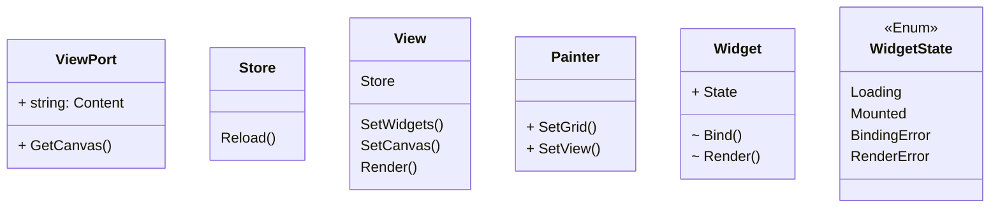
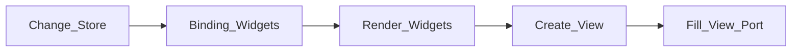

# RENDER

```mermaid
classDiagram
  %% Application layer
  class ViewPort{
    + GetCanvas()
    + string: Content
  }
  
  %% Хранит данные
  class Store {
    Reload()
  }
  
  %% Хранит разметку
  class View {
    Store
    SetWidgets()
    SetCanvas()
    Render()
  }
  
  %% Подгатавливает текст 
  class Painter {
    + SetGrid()
    + SetView()
  }
  
  %% Composition
  class Widget {
    + State
    ~ Bind()
    ~ Render()
  }

  class WidgetState
  <<Enum>> WidgetState
  WidgetState : Loading
  WidgetState : Mounted
  WidgetState : BindingError
  WidgetState : RenderError
```

```mermaid
flowchart LR
  Change_Store --> Binding_Widgets
  Binding_Widgets --> Render_Widgets
  Render_Widgets --> Create_View
  Create_View --> Fill_View_Port
```